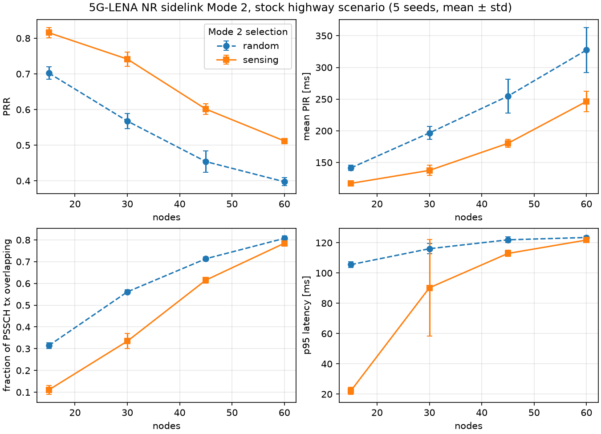

# sidewalk

5G-NR sidelink Mode 2 resource allocation for cooperative robots — built on ns-3 / 5G-LENA,
with ROS 2 co-simulation via ns3-cosim.

Robots that coordinate over PC5 without a base station have to pick their own radio resources.
Mode 2 does this with **sensing-based semi-persistent scheduling** (TS 38.214 §8.1.4, TS 38.321 §5.22):
listen for other UEs' reservations, exclude what's taken, pick from what's left, keep it for a while.
This repo measures how well that works under robot-like traffic and tries to do better.

## Status

- [x] Pinned, reproducible stack (arm64 + x86): CTTC ns-3 fork `ns-3-dev-v2x-v1.1` · 5G-LENA `nr` `v2x-1.1` · NIST `ns3-cosim`
- [x] Baseline sweep on the stock highway scenario: random vs sensing-based selection, node density × 5 seeds
- [x] `sidewalk-robots` scenario: N robots random-waypoint in a square area, every robot groupcasts a short state message every `msgPeriod` ms (ns-3 contrib module, `examples/`)
- [x] Sensing-algorithm instrumentation: one CSV row per TS 38.214 §8.1.4 execution via the `SensingAlgorithm` trace (`model/sensing-trace-sink`)
- [x] Sweeps: robot density, message period, radio configuration at 20 ms, scheduler SlotFraction (`scripts/sweep.sh` presets)
- [x] Own Mode 2 scheduler variant: `NrSlUeMacSchedulerEarliest` — latency-aware selection within the sensing-cleared candidate set (`model/`)
- [x] ROS 2 co-simulation: `rclcpp` robots ↔ ns3-cosim gateway ↔ 5G-LENA, lock-step in real time (`ros2/`, `model/robot-gateway`)

## Results so far

### Robots: density sweep

`sidewalk-robots`, 50 × 50 m, 1.5 m/s, 200 B every 100 ms per robot, V2V_Urban channel, 5 s, 5 seeds:


Sensing-based selection keeps PRR ≥ 0.85 and p95 latency ≈ 20 ms up to 20 robots, where random
selection has already degraded to PRR 0.68 / p95 112 ms. At 40 robots the pool is saturated for
both (collision fraction > 0.5) and latency jumps to the 100 ms SPS period — packets queue for the
next grant.

What the sensing algorithm is doing internally, from the per-selection trace:


Left: ~30 % of candidate resources are always excluded because the robot cannot sense while it
transmits (half-duplex, step 5 — a floor set by the 5 blind retransmissions per packet), while
exclusion of *other* robots' decoded reservations (step 6) grows from 7 % to 55 % with density.
Right: the "raise RSRP threshold by 3 dB until ≥ 20 % of candidates survive" back-off never fires
below 20 robots; at 40 it fires on 58 % of selections and needs ~9 steps (≈ 26 dB).

### Robots: message period, and tuning the radio for 20 ms

Same 20 robots, message period 100 → 40 → 20 ms (SPS reservation period follows the message period;
the selection window T2 is clamped to fit inside it, and the period must be a multiple of the 20-slot
physical pool, so 50 ms is not a legal value):

| period | PRR random / sensing | p95 latency | within 20 ms PDB (sensing) |
| --- | --- | --- | --- |
| 100 ms | 0.68 / 0.85 | 112 / 25 ms | 0.93 |
| 40 ms | 0.33 / 0.43 | 125 / 123 ms | 0.64 |
| 20 ms | 0.07 / 0.18 | 153 / 151 ms | 0.57 |

At 20 ms the default radio configuration is simply over capacity: 20 robots × 5 blind
retransmissions every 20 ms is ~100 slot-transmissions competing for ~60 resources, the RSRP
back-off fires on 85 % of selections, and sensing cannot help. What restores it
(`results/robots-tuning/`, 5 seeds):


| config (sensing on) | PRR | p95 latency | within PDB | overlapping tx |
| --- | --- | --- | --- | --- |
| default (5 retx, 50-RB subch, μ=0) | 0.18 | 151 ms | 0.57 | 0.87 |
| 1 retransmission | 0.89 | 19 ms | 0.98 | 0.03 |
| 2 retx + 10-RB subchannels | 0.77 | 21 ms | 0.95 | 0.02 |
| 2 retx + 10-RB subch + numerology 1 | 0.89 | 15 ms | 0.98 | 0.02 |
| 1 retx + 10-RB subch + numerology 1 | **0.95** | **17 ms** | **0.99** | 0.00 |

Blind retransmissions are the dominant knob: they multiply pool occupancy *and* the half-duplex
blind spots. Smaller subchannels (more, narrower resources for 200 B messages) and numerology 1
(0.5 ms slots, twice the selection opportunities inside the same PDB) buy the rest. Sensing matters
more, not less, once the pool is right-sized: with retx=1 it turns 41 % overlapping transmissions
into 3 %.

### Latency-aware selection: `NrSlUeMacSchedulerEarliest`

TS 38.321 has the MAC pick *uniformly at random* among the candidates that survived sensing. For
periodic traffic on a semi-persistent grant whose period equals the message period, the slot chosen
at (re)selection fixes the arrival-to-grant offset of every subsequent packet — so a uniform draw
costs on average half the selection window in latency, for no reliability benefit once sensing has
already removed the reserved resources.

`NrSlUeMacSchedulerEarliest` (`model/nr-sl-ue-mac-scheduler-earliest.{h,cc}`) subclasses the stock
`NrSlUeMacSchedulerFixedMcs` and overrides one method, `DoNrSlAllocation`: it keeps the earliest
`SlotFraction` of the candidate *slots* (never fewer than the blind retransmissions need) and delegates
to the base implementation for the draw, PSFCH/min-time-gap constraints and grant formatting.
`SlotFraction = 1` is the stock scheduler. Selected from the scenario with `--slotFraction`.

20 robots, 20 ms messages, tuned radio (1 retx, 10-RB subchannels, μ = 1), 5 seeds:


| SlotFraction | median latency | p95 | within 5 ms PDB | PRR (sensing) | PRR (random) | overlap (random) |
| --- | --- | --- | --- | --- | --- | --- |
| 1.0 (stock) | 9.7 ms | 17.0 ms | 0.19 | 0.948 | 0.873 | 0.10 |
| 0.25 | 4.3 ms | 7.4 ms | 0.64 | 0.942 | 0.867 | 0.10 |
| 0.1 | 3.2 ms | 6.0 ms | 0.85 | 0.931 | 0.820 | 0.14 |
| 0.0 (earliest) | 2.7 ms | 5.5 ms | 0.89 | 0.909 | 0.736 | 0.21 |

Median latency scales linearly with the fraction, as the SPS phase argument predicts. The cost
depends entirely on sensing: with sensing on, PRR gives up 0.6 pp at `0.25` and 4 pp at `0.0` with
no extra collisions; with random selection, greedy picking piles every robot onto the same early
slots and collisions double. Latency-aware selection and sensing are complementary, not
alternatives. `SlotFraction = 1.0` reproduces the stock scheduler bit-for-bit (same random draws
on the full list): its row matches the `retx1-sub10-mu1` row of the tuning sweep exactly
(PRR 0.948 / 0.873), which is the regression check.

**Versus the standard's own lever.** 3GPP already bounds latency through the packet delay budget:
T2 is derived from the PDB (`--pdb`, → `SidelinkInfo::m_pdb`), shrinking the selection window
itself. Same config, one seed:

| | median | p95 | p99 | within 5 ms | PRR |
| --- | --- | --- | --- | --- | --- |
| stock (PDB from T2 = 33 slots) | 9.3 ms | 16.5 ms | 45 ms | 0.16 | 0.945 |
| `--pdb=10` | 6.2 ms | 10.7 ms | 30 ms | 0.37 | 0.952 |
| `--pdb=5` | 3.6 ms | 6.0 ms | 63 ms | 0.75 | 0.933 |
| `--pdb=3` | aborts: T2 (6 slots) < T2min (10 slots at μ = 1) | | | | |
| `--slotFraction=0.1` | 3.3 ms | 6.5 ms | 44 ms | 0.80 | 0.933 |
| `--pdb=5 --slotFraction=0.1` | 2.4 ms | 6.0 ms | 46 ms | 0.86 | 0.927 |

So the PDB is the first thing to set, and it gets most of the way. What `SlotFraction` adds: it
keeps the *full* sensing/selection window for exclusion and only biases the draw, so it is not
floored by T2min (5 ms here), it does not shrink the candidate set the 20 %-back-off rule works on,
and it composes with the PDB. The p99 tail (~45 ms, ~1 % of packets) is unaffected by the fraction,
by the PDB, and by `slProbResourceKeep`; it is spread uniformly over time and across all robots.
Plausibly the SPS reselection gap, but not diagnosed here.

### ROS 2 co-simulation

The same scenario can be driven by ROS 2 instead of by ns-3's own mobility and traffic models
(`--cosimPort=<port>`). It follows the ROS-NetSim / CORNET pattern via NIST's ns3-cosim gateway:
ROS owns robots and time, ns-3 owns the radio, nothing is tunnelled.

```
ROS 2 (Humble, rclcpp)                                ns-3 / 5G-LENA
robot_node ×N ──/robot_i/pose──▶ bridge_node ──TCP──▶ RobotGateway : ns3::Gateway
   (random waypoint,                 │  every step_ms:        ExternalMobilityModel ← x y z
    PoseStamped every period_ms)     │  "sec nsec [x y z send]×N"   TriggeredSendApplication ← send
                                     │◀─ "[src:latency_us;…]×N" ── PacketSink Rx, matched to app Tx by packet UID
robot_node j ◀──/robot_j/neighbors── PoseArray of the senders' poses as transmitted
                 /sidewalk/latency_ms  one Float64 per delivery, + CSV
```

Time is lock-stepped: the bridge advances simulated time by `step_ms` per tick, ns-3 processes the
step and replies, and the bridge paces ticks to the wall clock (`realtime:=true`), so `ros2 topic
echo /robot_3/neighbors` shows neighbour states arriving with the sidelink's latency as they would on
a real PC5 link. A `send` flag is raised whenever a robot published a new pose since the last tick,
so emission timing is quantised to the bridge step (visible as stairs in the CDF below).

Validation, 10 robots / 100 ms messages / tuned radio, 20 s, co-simulated vs standalone:
PRR 0.971 vs 0.974, latency p50 9.1 vs 9.0 ms, p95 15.1 vs 16.6 ms (both PRRs count messages
sent after the sidelink bearers are active; latencies are matched tx→rx pairs on both sides).
The co-simulation also exposes something the standalone traffic model hides: p99 is 94 ms vs
17 ms. ns-3's OnOff source is perfectly periodic and stays phase-locked to its SPS grant forever;
the ROS robots' wall-clock timers jitter against the lock-stepped grant, so ~1 % of messages arrive
just after their grant and wait a full reservation period. (Whether the smaller ~45 ms tail seen in
the standalone 20 ms runs has a related cause is not established.)


```bash
docker exec slv2x bash /sidewalk/scripts/cosim.sh 10 100 20 --slMaxTxTransNumPssch=1 --slSubchannelSize=10 --numerologyBwpSl=1
#                                        robots period_ms duration_s  [any sidewalk-robots args]
.venv/bin/python analysis/cosim.py results/cosim/n10_p100.csv results/cosim/standalone_n10_p100-sidewalk-robots.db
```

`scripts/cosim.sh` launches `ros2 launch sidewalk_cosim cosim.launch.py` (N robots + bridge), then
starts ns-3 against the bridge; the launch shuts everything down when the bridge finishes. All in
the one dev container — ROS 2 Humble is installed there by `docker/ros2.sh`.

### Baseline: stock highway scenario

`nr-v2x-west-to-east-highway`, 3 lanes, 200 B every 100 ms per vehicle, 5 s, 5 seeds:



Same shape at larger scale: sensing buys 10–18 pp of PRR and roughly halves overlapping
transmissions at low density; the gain collapses above ~45 nodes.

## Layout

This repo is an ns-3 **contrib module** (`build_lib` in `CMakeLists.txt`); `docker/dev.sh` symlinks it to
`<ns-3-dev>/contrib/sidewalk`.

```
CMakeLists.txt      module definition (links against nr)
model/              nr-sl-ue-mac-scheduler-earliest.{h,cc} — latency-aware Mode 2 selection (DoNrSlAllocation override)
                    sensing-trace-sink.{h,cc} — CSV sink for NrSlUeMac's SensingAlgorithm trace
                    robot-gateway.{h,cc} — ns3-cosim Gateway: ROS 2 drives mobility + emission, deliveries flow back
examples/           sidewalk-robots.cc — the robot scenario (derived from the 5G-LENA highway example); --cosimPort for co-sim
ros2/sidewalk_cosim ROS 2 package: robot_node, bridge_node (TCP server of the gateway protocol), cosim.launch.py
docker/             setup.sh (verified ns-3 build), ros2.sh (ROS 2 Humble + colcon), Dockerfile, dev.sh (persistent dev container)
scripts/            sweep.sh <preset> — baseline | robots-density | robots-period | robots-tuning | robots-scheduler
                    cosim.sh — end-to-end ROS 2 + ns-3 run
analysis/           kpi.py <results dir> — runs.csv, summary.csv, kpi.png, sensing.png;  cosim.py — co-sim vs standalone CDF
results/            figures + summary CSVs are committed; .db, raw per-run CSVs and logs are not
```

### `sidewalk-robots` parameters

`--numRobots --areaSize --speed --antennaHeight --scenario={V2V_Urban,V2V_Highway,InH_OfficeOpen,UMi_StreetCanyon}
--msgPeriod --pdb --dynamic --reservationPeriod --slotFraction --cosimPort` plus every sidelink knob of the upstream example
(`--enableSensing --slSensingWindow --slSelectionWindow --t1 --t2 --slThresPsschRsrp --slProbResourceKeep
--slMaxTxTransNumPssch --slSubchannelSize --mcs --numerologyBwpSl --bandwidthBandSl ...`).

## Reproduce

```bash
bash docker/dev.sh                                   # container `slv2x`, ns-3 build on volume `slv2x-opt` (~40 min, -j4, 9 GB) + ROS 2 Humble
docker exec slv2x bash /sidewalk/scripts/sweep.sh robots-density   # ~2 min on 4 cores
docker exec slv2x bash /sidewalk/scripts/sweep.sh baseline         # ~10 min
python3 -m venv .venv && .venv/bin/pip install matplotlib pandas
.venv/bin/python analysis/kpi.py results/robots-density
```

Gotchas found on the way: the `nr` tag is `v2x-1.1` (the README says `v2x-v1.1`); the highway example
aborts on an even `numVehiclesPerLane` unless `--enableOneTxPerLane=0`; the optimized build profile has
`NS_LOG` compiled out, so the ns3-cosim examples run silently (and asserts are compiled out too: the
`V2V_Urban` channel model segfaults instead of complaining if nodes lack `MobilityBuildingInfo` — the
scenario installs `BuildingsHelper` for it); a `-j10` build OOM-killed a 12 GB VM; `v2x-kpi`'s `avrgPrr`
counts the transmitter as its own neighbour when every node is tx+rx (cap of (N−1)/N), so `kpi.py`
computes PRR from `pktTxRx` instead; the `SensingAlgorithm` trace's RSRP thresholds are uninitialised
on the very first selection (empty sensing window).

## Metrics (from `v2x-kpi`)

PRR, per-packet latency and PDB compliance from `pktTxRx` (tx/rx rows matched on source IP + sequence
number) · `avrgPir` packet inter-reception time · `simulPsschTx` overlapping transmissions (collisions) ·
`PsschTbRx` transport-block success/fail. Sensing internals from `<tag>-sensing.csv`: candidate set size
after each §8.1.4 step, initial/final RSRP threshold (→ back-off steps), sensing-window entries, tx history.
