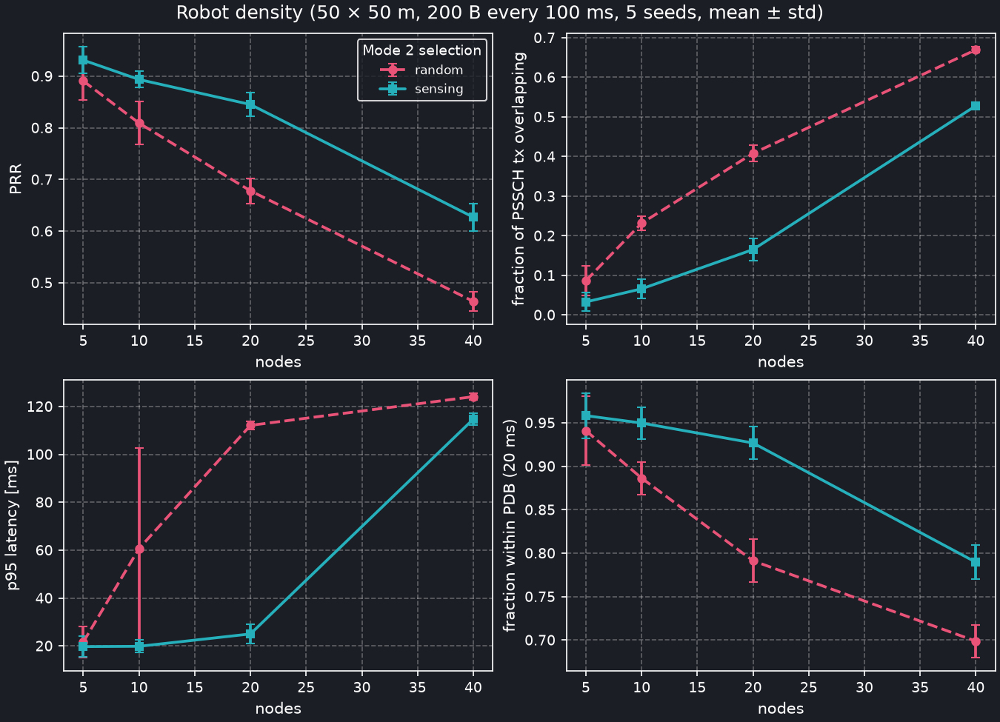
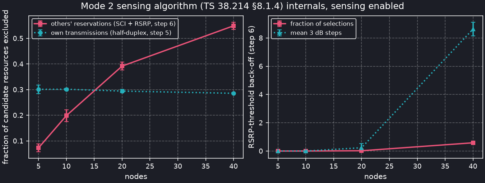
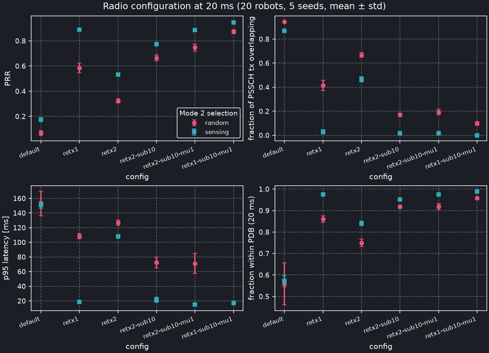
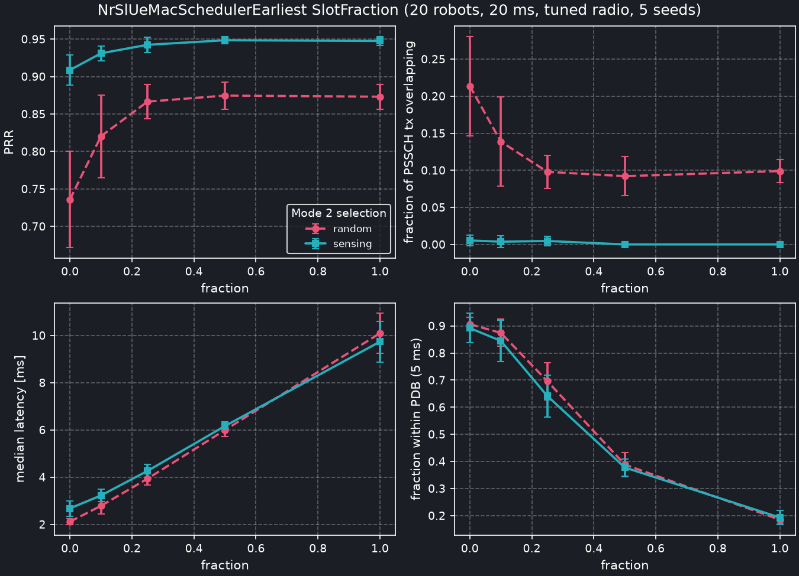
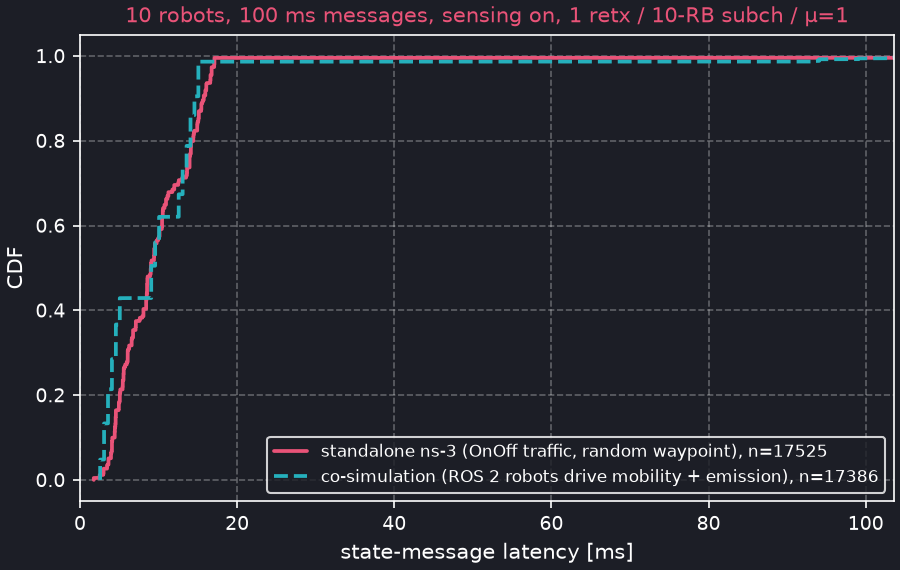
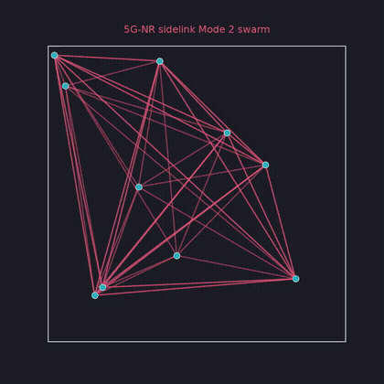

# Ultra-Low Latency Sidelink for Cooperative Robotics

This project is an end-to-end simulation of a robot swarm exchanging high-frequency state messages over **5G-NR Sidelink Mode 2 (PC5)**. 

Instead of relying on a central base station (gNB), the robots use distributed sensing and semi-persistent scheduling (SPS) to autonomously select radio resources. The goal is to guarantee ultra-low latency and high reliability for cooperative robotics (e.g., collision avoidance, swarm formation) in shared spectrum.

This repository features a hybrid co-simulation using the following tools:
- **ns-3 / 5G-LENA** models the 5G-NR physical and MAC layers, including a custom latency-aware Mode 2 MAC scheduler (`nr-sl-ue-mac-scheduler-earliest`).
- **ROS 2 (Humble)** drives the robot mobility (random waypoint) and application logic.
- The two are bridged via TCP lock-step (`ns3-cosim`), meaning the ROS 2 network sees real, accurate radio latency on its topics.

## Architecture

```text
ROS 2 (Humble)                                        ns-3 / 5G-LENA
robot_node × N ──/pose──▶ bridge_node ──TCP──▶ RobotGateway (ns3::Gateway)
   (mobility,                 │  every step_ms:               │
    state messages)           │  "sec nsec [x y z send]×N"    │
                              │◀─ "[src:latency_us;…]×N" ─────┘
robot_node ◀──/neighbors──────┘
           (received states)
```

Here, the ROS 2 bridge advances simulated time by `step_ms` per tick, ns-3 processes the step, computes the complex radio propagation/interference, and replies with the successful packet deliveries.

## Results

All the numbers below come from `scripts/sweep.sh` presets (5 seeds each unless stated and 5 s of simulated time) and `analysis/kpi.py`. The scenario is always the same: robots doing random waypoint in a 50 × 50 m area at 1.5 m/s, each one groupcasting a 200 byte state message every `msgPeriod` ms over the V2V_Urban channel. Every robot is both a transmitter and a receiver. PRR is computed directly from the application traces, since the upstream `avrgPrr` counts the transmitter as one of its own neighbours and caps out at (N−1)/N.

I compare the two Mode 2 flavours that 5G-LENA ships: **random** selection, where the MAC picks any resource in the selection window, and **sensing**, the full TS 38.214 §8.1.4 procedure (sensing window, exclusion of decoded reservations above an RSRP threshold, 3 dB back-off until 20 % of the candidates survive).

### Robot density

`sweep.sh robots-density`: 5, 10, 20 and 40 robots, 100 ms messages.



| robots | PRR random / sensing | overlapping tx | p95 latency random / sensing | within 20 ms (sensing) |
| ------ | -------------------- | -------------- | ---------------------------- | ---------------------- |
| 5      | 0.89 / 0.93          | 0.09 / 0.03    | 22 / 20 ms                   | 0.96                   |
| 10     | 0.81 / 0.89          | 0.23 / 0.07    | 61 / 20 ms                   | 0.95                   |
| 20     | 0.68 / 0.85          | 0.41 / 0.17    | 112 / 25 ms                  | 0.93                   |
| 40     | 0.46 / 0.63          | 0.67 / 0.53    | 124 / 115 ms                 | 0.79                   |

We can see two regimes! Up to 20 robots, sensing does its job: PRR stays above 0.85 and p95 latency stays around 20 ms, while random selection has already degraded to PRR 0.68 with a p95 of 112 ms. At 40 robots the pool is saturated for both schemes. More than half of the transmissions overlap and the p95 latency jumps to the 100 ms SPS period, which simply means packets are waiting for the next grant.

The sensing trace (`model/sensing-trace-sink`, one CSV row per run of the selection algorithm) tells us what is going on inside:



About 30 % of the candidate resources are always thrown away because the robot cannot sense while it transmits (half-duplex, step 5). This floor is set by the 5 blind retransmissions per packet and does not depend on density. The exclusion of *other* robots' reservations (step 6) is what grows, from 7 % at 5 robots to 55 % at 40. The RSRP back-off (i.e., raising the threshold by 3 dB until at least 20 % of the candidates survive) never fires below 20 robots. At 40 it fires on 58 % of the selections and needs about 9 steps, i.e. 26 dB, which is basically the algorithm giving up on exclusion.

### Message period, and tuning the radio for 20 ms

In `sweep.sh robots-period` for 20 robots, the period is varied down from 100 → 40 → 20 ms. SPS reservation period follows the message period, and two constraints come with this: 
- the period must be a multiple of the 20-slot physical pool (so 50 ms is not a legal value)
- the selection window T2 is clamped to fit inside it.

| period | PRR random / sensing | p95 latency  | within 20 ms (sensing) | back-off fires |
| ------ | -------------------- | ------------ | ---------------------- | -------------- |
| 100 ms | 0.68 / 0.85          | 112 / 25 ms  | 0.93                   | 2 %            |
| 40 ms  | 0.33 / 0.43          | 125 / 123 ms | 0.64                   | 84 %           |
| 20 ms  | 0.07 / 0.18          | 153 / 151 ms | 0.57                   | 85 %           |

At 20 ms the default radio configuration is simply over capacity. 20 robots × 5 blind retransmissions every 20 ms is about 100 slot-transmissions competing for roughly 60 resources. The back-off fires on 85 % of the selections and sensing cannot help anymore.

So the question becomes which radio knobs bring the pool back under capacity. We have `sweep.sh robots-tuning` trying them at 20 robots / 20 ms:



| config                                     | PRR random / sensing | overlapping tx (sensing) | p95 latency (sensing) | within 20 ms (sensing) |
| ------------------------------------------ | -------------------- | ------------------------ | --------------------- | ---------------------- |
| default (5 retx, 50-RB subchannels, μ = 0) | 0.07 / 0.18          | 0.87                     | 151 ms                | 0.57                   |
| 1 retransmission                           | 0.59 / 0.89          | 0.03                     | 19 ms                 | 0.98                   |
| 2 retransmissions                          | 0.32 / 0.53          | 0.47                     | 108 ms                | 0.84                   |
| 2 retx + 10-RB subchannels                 | 0.67 / 0.77          | 0.02                     | 21 ms                 | 0.95                   |
| 2 retx + 10-RB subch + μ = 1               | 0.75 / 0.89          | 0.02                     | 15 ms                 | 0.98                   |
| **1 retx + 10-RB subch + μ = 1**           | 0.87 / **0.95**      | **0.00**                 | **17 ms**             | **0.99**               |

We can see that the blind retransmissions are the dominant factor. They multiply the pool occupancy *and* the half-duplex blind spots, so going from 5 to 1 alone takes PRR from 0.18 to 0.89. Smaller subchannels (more, narrower resources, which is what a 200 byte message needs) and numerology 1 (0.5 ms slots, so twice the selection opportunities inside the same delay budget) buy the rest of the gains for us. One thing worth noting is that sensing matters *more* once the pool is right-sized, not less: with a single retransmission it turns 41 % overlapping transmissions into 3 %.

We use the last row (1 retx, 10-RB subchannels, μ = 1) as the "tuned" configuration for everything below.

### Latency-aware selection: `NrSlUeMacSchedulerEarliest`

TS 38.321 has the MAC pick *uniformly at random* among the candidates that survived sensing. For periodic traffic on a semi-persistent grant whose period equals the message period, the slot chosen at (re)selection fixes the offset between packet arrival and grant for every subsequent packet. A uniform draw therefore costs on average half the selection window in latency, and it buys nothing in reliability, since sensing has already removed the reserved resources.

`model/nr-sl-ue-mac-scheduler-earliest.{h,cc}` subclasses the stock `NrSlUeMacSchedulerFixedMcs` and overrides one method, `DoNrSlAllocation`. It keeps the earliest `SlotFraction` of the candidate *slots* (never fewer than the retransmissions need) and hands the rest back to the base class for the random draw, the PSFCH / minimum-time-gap constraints and the grant formatting. `SlotFraction = 1` is the stock scheduler. It is selected in the scenario with `--slotFraction`.



| SlotFraction        | median latency | p95     | within 5 ms | PRR sensing / random | overlapping tx (random) |
| ------------------- | -------------- | ------- | ----------- | -------------------- | ----------------------- |
| 1.0 (stock)         | 9.7 ms         | 17.0 ms | 0.19        | 0.948 / 0.873        | 0.10                    |
| 0.5                 | 6.2 ms         | 10.2 ms | 0.38        | 0.948 / 0.875        | 0.09                    |
| 0.25                | 4.3 ms         | 7.4 ms  | 0.64        | 0.942 / 0.867        | 0.10                    |
| 0.1                 | 3.2 ms         | 6.0 ms  | 0.85        | 0.931 / 0.820        | 0.14                    |
| 0.0 (earliest only) | 2.7 ms         | 5.5 ms  | 0.89        | 0.909 / 0.736        | 0.21                    |

We see that the median latency scales linearly with the fraction, which is what the SPS phase argument predicts. What it costs depends entirely on sensing. With sensing on, PRR gives up 0.6 pp at 0.25 and 4 pp at 0.0, with no extra collisions. With random selection, every robot greedily piles onto the same early slots and collisions double. So latency-aware selection and sensing are complementary and not alternatives!

 The `SlotFraction = 1.0` row reproduces the stock scheduler bit-for-bit (same random draws on the full candidate list) and matches the tuned row of the tuning sweep exactly (PRR 0.948 / 0.873), which acts as a nice regression check.

3GPP already bounds latency through the packet delay budget: T2 is derived from the PDB (`--pdb` → `SidelinkInfo::m_pdb`), which shrinks the selection window itself.

|                              | median                                                       | p95     | p99   | within 5 ms | PRR   | half-duplex exclusion |
| ---------------------------- | ------------------------------------------------------------ | ------- | ----- | ----------- | ----- | --------------------- |
| stock (T2 = 33 slots)        | 9.8 ms                                                       | 17.0 ms | 30 ms | 0.18        | 0.946 | 6 %                   |
| `--pdb=10`                   | 6.4 ms                                                       | 10.6 ms | 27 ms | 0.35        | 0.950 | 10 %                  |
| `--pdb=5`                    | 3.7 ms                                                       | 5.9 ms  | 38 ms | 0.74        | 0.939 | 23 %                  |
| `--pdb=3`                    | aborts: T2 would be 6 slots, below T2min (10 slots at μ = 1) |         |       |             |       |                       |
| `--slotFraction=0.1`         | 3.1 ms                                                       | 6.2 ms  | 37 ms | 0.83        | 0.930 | 6 %                   |
| `--pdb=5 --slotFraction=0.1` | 2.5 ms                                                       | 5.7 ms  | 51 ms | 0.89        | 0.914 | 23 %                  |

So the PDB is the first thing to set, and it gets most of the way. What `SlotFraction` adds is that it keeps the *full* selection window for exclusion and only biases the draw. It is therefore not floored by T2min (5 ms here) and it does not shrink the candidate set that the 20 % back-off rule works on. It also composes with the PDB. The last column shows the difference by shrinking T2 to 5 ms which makes the robot's own transmissions eat 23 % of the (now small) window, while the fraction leaves that at 6 %.

There is one thing we did not resolve. In every configuration above, 1–1.7 % of the packets land well outside the selection window, at 25–55 ms. The share of late packets barely changes with the fraction or the PDB, but the tail gets deeper the more we squeeze the selection: p99 goes from 30 ms at the stock scheduler to 56 ms at `SlotFraction = 0`. It is spread uniformly over time and across all robots. My guess (?) is the gap at SPS reselection (the old grant expires before the new one is usable, and biasing towards the earliest slots makes that gap bite harder), but we have not diagnosed it.

### ROS 2 co-simulation

The same scenario can be driven by ROS 2 instead of ns-3's own mobility and traffic models (`--cosimPort`). I follow the ROS-NetSim / CORNET pattern through NIST's ns3-cosim gateway. Here, ROS controls the robots and the clock, ns-3 owns the radio, and nothing is tunnelled. The bridge advances simulated time by `step_ms` per tick, ns-3 processes the step, and the reply carries the deliveries that happened in it, which the bridge republishes as `/robot_j/neighbors`. A `send` flag is raised whenever a robot published a new pose since the last tick, so emission timing is quantised to the bridge step (the stairs in the CDF below).

I validated it against a standalone run of the same configuration (10 robots, 100 ms, tuned radio, 20 s):



|                                 | PRR   | p50    | p95     | p99   |
| ------------------------------- | ----- | ------ | ------- | ----- |
| standalone ns-3 (OnOff traffic) | 0.974 | 9.0 ms | 16.6 ms | 17 ms |
| co-simulation (ROS 2 robots)    | 0.971 | 9.1 ms | 15.1 ms | 94 ms |

Both PRRs only count messages sent after the sidelink bearers are active, and latencies are matched tx → rx pairs on both sides. The distributions agree up to p95.  p99 is interesting though! 

From some clever AI-aided research it seems, ns-3's OnOff source is perfectly periodic and stays phase-locked to its SPS grant forever, whereas the ROS robots' wall-clock timers jitter against the lock-stepped grant, so about 1 % of the messages arrive just after their grant and wait a full reservation period. I believe the same effect would exist on real hardware.

```bash
docker exec slv2x bash /sidewalk/scripts/cosim.sh 10 100 20 --slMaxTxTransNumPssch=1 --slSubchannelSize=10 --numerologyBwpSl=1
.venv/bin/python analysis/cosim.py results/cosim/n10_p100.csv results/cosim/standalone_n10_p100-sidewalk-robots.db
```

### Reproducing

```bash
docker exec slv2x bash /sidewalk/scripts/sweep.sh robots-density     # also: robots-period robots-tuning robots-scheduler robots-pdb
.venv/bin/python analysis/kpi.py results/robots-density
.venv/bin/python analysis/kpi.py results/robots-period
.venv/bin/python analysis/kpi.py results/robots-tuning --order default,retx1,retx2,retx2-sub10,retx2-sub10-mu1,retx1-sub10-mu1
.venv/bin/python analysis/kpi.py results/robots-scheduler --pdb-ms 5
.venv/bin/python analysis/kpi.py results/robots-pdb --pdb-ms 5 --order stock,pdb10,pdb5,frac0.1,pdb5-frac0.1
```

## Repository Layout

This repo is structured as an ns-3 **contrib module**.
- `model/`: The core C++ ns-3 models.
  - `nr-sl-ue-mac-scheduler-earliest`: Latency-aware Mode 2 resource selection scheduler.
  - `robot-gateway`: The TCP gateway synchronizing ns-3 with ROS 2.
  - `sensing-trace-sink`: Hooks into the MAC layer to export 3GPP TS 38.214 §8.1.4 sensing metrics.
- `examples/sidewalk-robots.cc`: The main ns-3 simulation script orchestrating the UE configuration, mobility, and traffic.
- `ros2/sidewalk_cosim/`: The ROS 2 package containing the `robot_node` and `bridge_node`.
- `docker/`: Container definitions to build ns-3 and ROS 2 Humble without host pollution.
- `scripts/`: Batch execution scripts for parameter sweeps (`sweep.sh <preset>`) and co-simulation runs (`cosim.sh`).
- `analysis/`: Python scripts (pandas/matplotlib) to parse the SQLite/CSV traces and generate KPIs (PRR, latency CDFs). `style.mplstyle` is the plot theme.

## How to Run

Everything runs inside a Docker dev container to avoid polluting your host with ns-3 and ROS 2 dependencies.

```bash
# build the persistent dev container (installs ns-3, 5G-LENA, and ROS 2)
bash docker/dev.sh

# drop into the container
docker exec -it slv2x bash

# run the standalone ns-3 density sweep
bash /sidewalk/scripts/sweep.sh robots-density

# or run the full ROS 2 + ns-3 co-simulation
bash /sidewalk/scripts/cosim.sh 10 100 20  # 10 robots, 100ms msgs, 20s duration
```

## Visualization

You can generate a beautiful MP4/GIF animation of the robot swarm communicating directly from the SQLite packet traces! The script reconstructs the mobility and highlights successful 5G Sidelink message deliveries in real-time.

```bash
# Assuming you've already generated a results database:
.venv/bin/python analysis/animate.py results/robots-density/nodes=10_scheme=1_run=1-sidewalk-robots.db
```
*(This outputs an MP4 video showing the 50x50m area with nodes flashing on message reception).*


